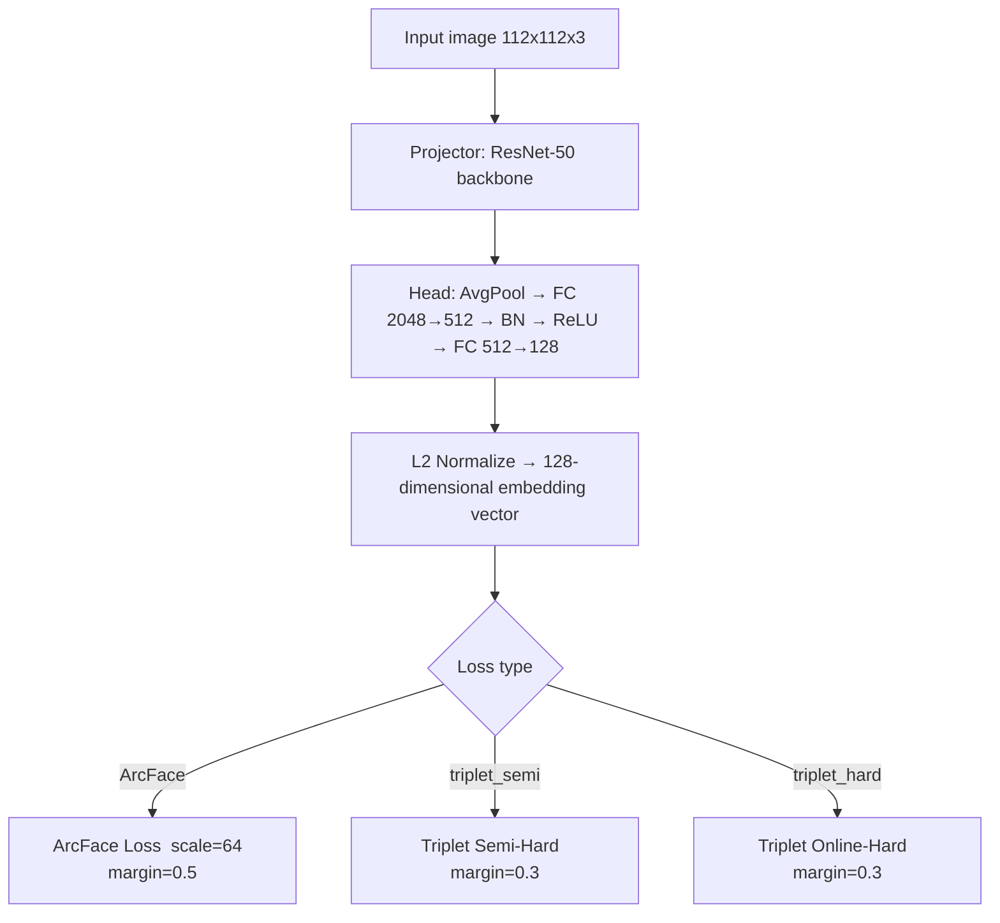
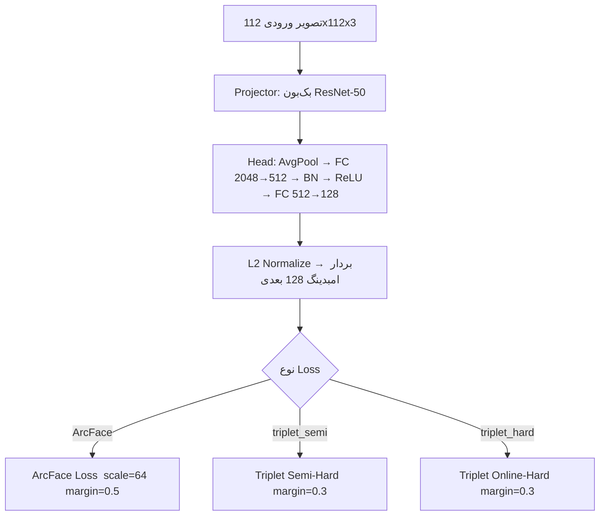

# FaceRecognitionCPP — Trainer

## English Version

This section of the [FaceRecognitionCPP](https://github.com/Kouroshilchi/FaceRecognitionCPP) project is the training pipeline for face embedding models in **C++17** using **LibTorch (PyTorch C++ API)** and **OpenCV**. The ResNet-50 backbone is combined with a custom embedding head and supports three selectable loss functions — **ArcFace**, **Triplet Semi-Hard**, and **Triplet Online-Hard**. At the end of each epoch, the model accuracy on the **LFW** dataset is evaluated.

---

## Table of Contents

- [Features](#features)
- [Model Architecture](#model-architecture)
- [Project Structure](#project-structure)
- [Prerequisites](#prerequisites)
- [Build](#build)
- [Data Preparation](#data-preparation)
- [How to Run](#how-to-run)
- [Command-Line Arguments](#command-line-arguments)
- [Loss Functions](#loss-functions)
- [Checkpoint and Resume](#checkpoint-and-resume)
- [Evaluation on LFW](#evaluation-on-lfw)
- [License](#license)

---

## Features

- 🧠 ResNet-50 backbone with support for loading pretrained weights from `resnet50_weights.pt` in TorchScript format
- 🎯 Loss selection from the command line: `ArcFace`, `triplet_semi`, `triplet_hard`
- ⚖️ Balanced Batch Sampler (P×K sampling) for constructing batches with balanced class and sample counts
- 🖼️ Online augmentation on images (rotation, horizontal flip, brightness/contrast adjustment, random shifting)
- 📊 Automatic evaluation of accuracy on **LFW** (best threshold, positive/negative accuracy) after each epoch
- 💾 Automatic checkpoint saving (every 1000 batches + end of each epoch) with `--resume` support
- 🔧 Separate learning rates for the backbone, head, and ArcFace (three optimizer parameter groups) plus a `StepLR` scheduler
- 🖥️ Automatic GPU (CUDA) detection; otherwise runs on CPU

---

## Model Architecture



| Component | Description |
|---|---|
| `Model::projector` | ResNet-50 backbone (`conv1` + `layer1..layer4`, `Bottleneck` blocks, expansion=4) |
| `Model::head` | `AdaptiveAvgPool2d → Linear(2048,512) → BatchNorm1d → ReLU → Linear(512, embedding_dim)` + L2 normalization |
| `Loss::ArcFace` | Adds an angular margin to the cosine similarity of the correct class, then applies Cross-Entropy |
| `Loss::TripletLoss` | Two mining modes: `forward_semi_hard` and `forward_online_hard` based on Euclidean distance between embeddings |

---

## Project Structure

```
Trainer/
├── main.cpp                        # Main training loop
├── include/
│   ├── Model/
│   │   ├── Model.h / .cpp          # FaceRecognitionModel = projector + head
│   │   ├── backbone.h / .cpp       # Lightweight CNN backbone (optional)
│   │   ├── projector.h / .cpp      # ResNet-50 backbone + pretrained weight loading
│   │   ├── head.h / .cpp           # Embedding head
│   │   ├── Bottleneck.h / .cpp     # Lightweight ResNet Bottleneck block
│   │   ├── ResBlock.h / .cpp       # Simple residual block
│   │   └── FaceNet.h / .cpp        # Full model + loss selection + forward/embed
│   ├── Loss/
│   │   ├── ArcFace.h / .cpp
│   │   ├── TripletLoss.h / .cpp
│   │   └── LossMetrics.h
│   ├── Dataset/
│   │   ├── Dataset.h / .cpp        # Folder-based FaceDataset + augmentation
│   │   ├── TripletDataset.h / .cpp # Anchor/Positive/Negative dataset
│   │   └── BalancedSampler.h       # Balanced P×K sampler
│   └── Utils/
│       ├── HardMining.h / .cpp
│       └── AccuracyLFW.h / .cpp    # LFW accuracy evaluation
└── src/                             # Corresponding implementations for include/
```

> This folder is part of the main repository [FaceRecognitionCPP](https://github.com/Kouroshilchi/FaceRecognitionCPP), which also includes `appCPP/` (desktop app with ImGui/DirectX11) and `utils/ModelExporter/` (model export). The main build file (`CMakeLists.txt`) is located at the repository root.

---

## Prerequisites

| Tool | Recommended Version |
|---|---|
| C++17 Compiler | MSVC 2019+ (the main project is configured for Windows) |
| [LibTorch](https://pytorch.org/get-started/locally/) | Version compatible with your system CUDA |
| [OpenCV](https://opencv.org/releases/) | ≥ 4.x |
| CMake | ≥ 3.18 |
| CUDA-capable GPU (optional) | For faster training |

---

## Build

The project `CMakeLists.txt` uses the following default paths for LibTorch and OpenCV on Windows:

```cmake
set(CMAKE_PREFIX_PATH "C:/libs/release/libtorch")
set(Torch_DIR "C:/libs/release/libtorch/share/cmake/Torch")
set(OpenCV_DIR "C:/libs/opencv/build")
```

If LibTorch and OpenCV are installed in a different location, update these values in `CMakeLists.txt` or override them during CMake configuration:

```powershell
cmake -B build -G "Visual Studio 16 2019" -A x64 ^
  -DCMAKE_PREFIX_PATH="D:/libs/libtorch" ^
  -DTorch_DIR="D:/libs/libtorch/share/cmake/Torch" ^
  -DOpenCV_DIR="D:/libs/opencv/build"

cmake --build build --config Release
```

This build produces three executables: `FaceRecognitionCPP` (the trainer, which this README describes), `ExportModel`, and `FaceRecognitionAPP`. The `FaceRecognitionCPP` binary is typically located at `build/Release/FaceRecognitionCPP.exe`.

---

## Data Preparation

The program detects the repository root (`repo_root`) from the executable path or the `REPO_ROOT` environment variable and expects the following structure beside it:

```
<repo_root>/
├── models/
│   ├── resnet50_weights.pt     # TorchScript weights for ResNet-50 (optional, for pretrained=true)
│   └── model.pt                 # Path for saving/loading the model checkpoint
└── data/
    ├── data_vgg2_casia/         # Training dataset
    │   ├── <person_id_1>/
    │   │   ├── img_0001.jpg
    │   │   └── ...
    │   └── <person_id_2>/
    └── data_LFW/                 # Evaluation dataset
        ├── pairs.csv             # or pairs.txt
        └── <person_id>/img_....jpg
```

- **Training dataset**: each folder represents one identity (class); at least 2 images per class are required; supported formats: `.jpg .jpeg .png .bmp .tiff .tif`.
- **`pairs.csv`**: a CSV file with a header, following the standard LFW format; images are searched using the pattern `<name>/<name>_<4-digit-number>.jpg`.
- **`resnet50_weights.pt`**: a TorchScript module with keys `conv1`, `bn1`, `layer1..layer4` matching torchvision ResNet-50 naming.
- **Image preprocessing**: resizing to `112×112`, BGR→RGB conversion, normalization with `mean=[0.485,0.456,0.406]` and `std=[0.229,0.224,0.225]`.

If `data_LFW` or `pairs.csv` is not found, the LFW evaluation only prints a warning and training does not stop.

---

## How to Run

```bash
# Train from scratch with default settings
./FaceRecognitionCPP

# Continue training from a saved checkpoint
./FaceRecognitionCPP --resume

# Train without pretrained ResNet-50 weights
./FaceRecognitionCPP --scratch

# Select a loss type and custom learning rates
./FaceRecognitionCPP --loss triplet_hard --model_lr 5e-5 --arcface_lr 1e-4 --lastlayer_lr 1e-4 --log_step 50
```

By setting the `REPO_ROOT` environment variable, the program can use the repository path directly instead of inferring it from the binary location:

```bash
REPO_ROOT=/path/to/FaceRecognitionCPP ./FaceRecognitionCPP
```

---

## Command-Line Arguments

| Argument | Type | Default | Description |
|---|---|---|---|
| `--resume` | flag | `false` | Load the latest checkpoint from `models/model.pt` and continue training |
| `--scratch` | flag | `false` | Do not use pretrained ResNet-50 weights |
| `--loss <arcface\|triplet_semi\|triplet_hard>` | string | `ArcFace` | Choose the training loss function |
| `--model_lr <float>` | double | `1e-4` | Learning rate for the backbone (ResNet-50) |
| `--lastlayer_lr <float>` | double | `1e-4` | Learning rate for the embedding head |
| `--arcface_lr <float>` | double | `1e-4` | Learning rate for ArcFace weights |
| `--log_step <int>` | int | `100` | Logging interval in terms of batch count |

The current parameters `P=32`, `K=4`, `image_size=112×112`, `embedding_dim=128`, `epochs=100`, and ArcFace `scale=64.0`/`margin=0.5` are configured inside `main.cpp`.

---

## Loss Functions

### ArcFace
Adds an angular margin (`m=0.5`) to the cosine similarity between the embedding and the target class weight, then multiplies by `scale=64` and applies Cross-Entropy. It includes a monotonicity fix for cases where `theta + m` exceeds $\pi$.

### Triplet Semi-Hard
For each anchor, the hardest positive sample is selected; then among the negatives, semi-hard samples (with distance between `hardest_pos` and `hardest_pos + margin`) are searched first, and if none are found, the hardest negative is used instead.

### Triplet Online-Hard (Batch-Hard)
For each anchor, the hardest positive and hardest negative in the entire batch are selected simultaneously, and the loss is computed with `margin=0.3`; it depends on the balanced P×K sampler.

All three losses return a shared `Loss::LossMetrics` structure: `loss`, `avg_pos_metric`, `avg_neg_metric`, `num_valid_triplets`, and `num_zero_loss_triplets`.

---

## Checkpoint and Resume

- Automatically saves every 1000 batches and at the end of each epoch to `models/model.pt` (using `torch::save`, including all `FaceNet` parameters).
- With the `--resume` flag, the model is restored using `torch::load` from the same path and training continues.

---

## Evaluation on LFW

After each epoch, the `Utils::AccuracyLFW` class:
1. Reads image pairs from `pairs.csv`/`pairs.txt`.
2. Computes embeddings for the required images with batch size 16.
3. Searches for the best threshold (500 steps by default) and reports the overall accuracy and the accuracy of positive/negative pairs.

Example output:
```
[LFW] Total pairs    : 6000
[LFW] Accuracy (best thr=0.42): 91.35%
```

---

## License

This project is released under the [MIT](https://github.com/Kouroshilchi/FaceRecognitionCPP/blob/main/LICENSE) license.

---

## نسخه فارسی

بخش **Trainer** از پروژهٔ [FaceRecognitionCPP](https://github.com/Kouroshilchi/FaceRecognitionCPP): یک پایپ‌لاین آموزش مدل embedding چهره به زبان **C++17** با **LibTorch (PyTorch C++ API)** و **OpenCV**. بک‌بون ResNet-50 با هد امبدینگ سفارشی ترکیب شده و از سه Loss قابل انتخاب — **ArcFace**، **Triplet Semi-Hard** و **Triplet Online-Hard** — پشتیبانی می‌کند. در پایان هر epoch دقت مدل روی دیتاست **LFW** ارزیابی می‌شود.

---

## فهرست مطالب

- [ویژگی‌ها](#ویژگی‌ها)
- [معماری مدل](#معماری-مدل)
- [ساختار پروژه](#ساختار-پروژه)
- [پیش‌نیازها](#پیش‌نیازها)
- [ساخت پروژه (Build)](#ساخت-پروژه-build)
- [آماده‌سازی داده‌ها](#آماده‌سازی-داده‌ها)
- [نحوه اجرا](#نحوه-اجرا)
- [آرگومان‌های خط فرمان](#آرگومان‌های-خط-فرمان)
- [Loss Functions](#loss-functions)
- [Checkpoint و Resume](#checkpoint-و-resume)
- [ارزیابی روی LFW](#ارزیابی-روی-lfw)
- [لایسنس](#لایسنس)

---

## ویژگی‌ها

- 🧠 بک‌بون **ResNet-50** با قابلیت لود وزن‌های از پیش آموزش‌دیده (`resnet50_weights.pt` به فرمت TorchScript)
- 🎯 انتخاب Loss از خط فرمان: `ArcFace`، `triplet_semi`، `triplet_hard`
- ⚖️ **Balanced Batch Sampler (P×K sampling)** برای ساخت بچ‌هایی با تعداد کلاس و نمونهٔ متعادل
- 🖼️ Augmentation آنلاین روی تصاویر (چرخش، فلیپ افقی، تغییر روشنایی/کنتراست، جابه‌جایی تصادفی)
- 📊 ارزیابی خودکار دقت روی **LFW** (بهترین threshold، accuracy مثبت/منفی) پس از هر epoch
- 💾 ذخیرهٔ خودکار checkpoint (هر ۱۰۰۰ بچ + پایان هر epoch) و قابلیت `--resume`
- 🔧 نرخ یادگیری جداگانه برای بک‌بون، هد و ArcFace (سه Optimizer Param Group) + `StepLR` scheduler
- 🖥️ تشخیص خودکار GPU (CUDA)، در غیر این‌صورت اجرا روی CPU

---

## معماری مدل



| بخش | توضیح |
|---|---|
| `Model::projector` | بک‌بون ResNet-50 (`conv1` + `layer1..layer4`، بلوک‌های `Bottleneck`، expansion=4) |
| `Model::head` | `AdaptiveAvgPool2d → Linear(2048,512) → BatchNorm1d → ReLU → Linear(512, embedding_dim)` + نرمال‌سازی L2 |
| `Loss::ArcFace` | افزودن margin زاویه‌ای به cosine similarity کلاس درست، سپس Cross-Entropy |
| `Loss::TripletLoss` | دو حالت mining: `forward_semi_hard` و `forward_online_hard` بر پایهٔ فاصلهٔ اقلیدسی بین امبدینگ‌ها |

---

## ساختار پروژه

```
Trainer/
├── main.cpp                        # حلقهٔ اصلی آموزش
├── include/
│   ├── Model/
│   │   ├── Model.h / .cpp          # FaceRecognitionModel = projector + head
│   │   ├── backbone.h / .cpp       # بک‌بون CNN سبک (اختیاری)
│   │   ├── projector.h / .cpp      # بک‌بون ResNet-50 + لود وزن‌های pretrained
│   │   ├── head.h / .cpp           # هد امبدینگ
│   │   ├── Bottleneck.h / .cpp     # بلوک Bottleneck سبک ResNet
│   │   ├── ResBlock.h / .cpp       # بلوک Residual ساده
│   │   └── FaceNet.h / .cpp        # مدل کامل + انتخاب Loss + forward/embed
│   ├── Loss/
│   │   ├── ArcFace.h / .cpp
│   │   ├── TripletLoss.h / .cpp
│   │   └── LossMetrics.h
│   ├── Dataset/
│   │   ├── Dataset.h / .cpp        # FaceDataset (کلاس بر اساس پوشه) + Augmentation
│   │   ├── TripletDataset.h / .cpp # دیتاست Anchor/Positive/Negative
│   │   └── BalancedSampler.h       # Sampler متعادل P×K
│   └── Utils/
│       ├── HardMining.h / .cpp
│       └── AccuracyLFW.h / .cpp    # ارزیابی دقت روی LFW
└── src/                             # پیاده‌سازی متناظر با include/
```

> این پوشه بخشی از ریپازیتوری اصلی [FaceRecognitionCPP](https://github.com/Kouroshilchi/FaceRecognitionCPP) است که علاوه بر `Trainer/`، شامل `appCPP/` (اپلیکیشن دسکتاپ با ImGui/DirectX11) و `utils/ModelExporter/` (خروجی‌گیری از مدل) نیز می‌شود. فایل بیلد اصلی (`CMakeLists.txt`) در ریشهٔ همان ریپازیتوری قرار دارد.

---

## پیش‌نیازها

| ابزار | نسخه پیشنهادی |
|---|---|
| کامپایلر C++17 | MSVC 2019+ (پروژه اصلی برای ویندوز پیکربندی شده) |
| [LibTorch](https://pytorch.org/get-started/locally/) | نسخهٔ متناسب با CUDA سیستم |
| [OpenCV](https://opencv.org/releases/) | ≥ 4.x |
| CMake | ≥ 3.18 |
| GPU با CUDA (اختیاری) | برای آموزش با سرعت مناسب |

---

## ساخت پروژه (Build)

`CMakeLists.txt` پروژه به‌صورت پیش‌فرض مسیرهای زیر را برای LibTorch و OpenCV در نظر می‌گیرد (روی ویندوز):

```cmake
set(CMAKE_PREFIX_PATH "C:/libs/release/libtorch")
set(Torch_DIR "C:/libs/release/libtorch/share/cmake/Torch")
set(OpenCV_DIR "C:/libs/opencv/build")
```

اگر LibTorch و OpenCV را در مسیر دیگری نصب کرده‌اید، این مقادیر را در `CMakeLists.txt` اصلاح کنید یا هنگام اجرای CMake override کنید:

```powershell
cmake -B build -G "Visual Studio 16 2019" -A x64 ^
  -DCMAKE_PREFIX_PATH="D:/libs/libtorch" ^
  -DTorch_DIR="D:/libs/libtorch/share/cmake/Torch" ^
  -DOpenCV_DIR="D:/libs/opencv/build"

cmake --build build --config Release
```

از این بیلد سه اجرایی ساخته می‌شود: `FaceRecognitionCPP` (Trainer، همان بخشی که این README مربوط به آن است)، `ExportModel` و `FaceRecognitionAPP`. باینری `FaceRecognitionCPP` معمولاً در `build/Release/FaceRecognitionCPP.exe` قرار می‌گیرد.

---

## آماده‌سازی داده‌ها

برنامه مسیر ریشهٔ ریپازیتوری (`repo_root`) را از مسیر فایل اجرایی یا متغیر محیطی `REPO_ROOT` تشخیص می‌دهد و ساختار زیر را در کنار آن انتظار دارد:

```
<repo_root>/
├── models/
│   ├── resnet50_weights.pt     # وزن‌های TorchScript شدهٔ ResNet-50 (اختیاری، برای pretrained=true)
│   └── model.pt                 # محل ذخیره/بارگذاری checkpoint مدل
└── data/
    ├── data_vgg2_casia/         # دیتاست آموزش
    │   ├── <person_id_1>/
    │   │   ├── img_0001.jpg
    │   │   └── ...
    │   └── <person_id_2>/
    └── data_LFW/                 # دیتست ارزیابی
        ├── pairs.csv             # یا pairs.txt
        └── <person_id>/img_....jpg
```

- **دیتاست آموزش**: هر پوشه یک هویت (کلاس) است، حداقل ۲ تصویر در هر کلاس، فرمت‌های مجاز: `.jpg .jpeg .png .bmp .tiff .tif`.
- **`pairs.csv`**: فایل CSV با هدر، مطابق فرمت استاندارد LFW؛ تصاویر با الگوی `<name>/<name>_<شماره ۴رقمی>.jpg` جست‌وجو می‌شوند.
- **`resnet50_weights.pt`**: یک ماژول TorchScript با کلیدهای `conv1`, `bn1`, `layer1..layer4` مطابق نام‌گذاری torchvision ResNet-50.
- **پیش‌پردازش تصاویر**: تغییر اندازه به `112×112`، تبدیل BGR→RGB، نرمال‌سازی با `mean=[0.485,0.456,0.406]` و `std=[0.229,0.224,0.225]`.

اگر `data_LFW` یا `pairs.csv` پیدا نشود، ارزیابی LFW فقط یک هشدار چاپ می‌کند و آموزش متوقف نمی‌شود.

---

## نحوه اجرا

```bash
# آموزش از صفر با تنظیمات پیش‌فرض
./FaceRecognitionCPP

# ادامهٔ آموزش از checkpoint ذخیره‌شده
./FaceRecognitionCPP --resume

# آموزش بدون وزن‌های pretrained ResNet-50
./FaceRecognitionCPP --scratch

# انتخاب نوع Loss و نرخ‌های یادگیری سفارشی
./FaceRecognitionCPP --loss triplet_hard --model_lr 5e-5 --arcface_lr 1e-4 --lastlayer_lr 1e-4 --log_step 50
```

با تنظیم متغیر محیطی `REPO_ROOT`، به‌جای حدس‌زدن مسیر از روی محل باینری استفاده می‌شود:

```bash
REPO_ROOT=/path/to/FaceRecognitionCPP ./FaceRecognitionCPP
```

---

## آرگومان‌های خط فرمان

| آرگومان | نوع | پیش‌فرض | توضیح |
|---|---|---|---|
| `--resume` | flag | `false` | بارگذاری آخرین checkpoint از `models/model.pt` و ادامهٔ آموزش |
| `--scratch` | flag | `false` | عدم استفاده از وزن‌های pretrained ResNet-50 |
| `--loss <arcface\|triplet_semi\|triplet_hard>` | string | `ArcFace` | انتخاب تابع Loss آموزش |
| `--model_lr <float>` | double | `1e-4` | نرخ یادگیری بک‌بون (ResNet-50) |
| `--lastlayer_lr <float>` | double | `1e-4` | نرخ یادگیری هد امبدینگ |
| `--arcface_lr <float>` | double | `1e-4` | نرخ یادگیری وزن‌های ArcFace |
| `--log_step <int>` | int | `100` | فاصلهٔ چاپ لاگ بر حسب تعداد بچ |

پارامترهای `P=32`, `K=4`, `image_size=112×112`, `embedding_dim=128`, `epochs=100`, ArcFace `scale=64.0`/`margin=0.5` در حال حاضر داخل `main.cpp` تنظیم می‌شوند.

---

## Loss Functions

### ArcFace
افزودن یک margin زاویه‌ای (`m=0.5`) به cosine similarity بین امبدینگ و وزن کلاس هدف، سپس ضرب در `scale=64` و اعمال Cross-Entropy؛ شامل فیکس monotonicity برای زمانی که `theta + m` از π عبور می‌کند.

### Triplet Semi-Hard
برای هر anchor، سخت‌ترین نمونهٔ مثبت انتخاب می‌شود؛ سپس در بین منفی‌ها ابتدا نمونه‌های *semi-hard* (فاصله‌ای بین `hardest_pos` و `hardest_pos + margin`) جست‌وجو می‌شوند و در نبود آن‌ها سخت‌ترین منفی جایگزین می‌شود.

### Triplet Online-Hard (Batch-Hard)
برای هر anchor به‌صورت هم‌زمان سخت‌ترین مثبت و سخت‌ترین منفی در کل بچ انتخاب و loss با `margin=0.3` محاسبه می‌شود؛ به Sampler متعادل P×K وابسته است.

هر سه Loss یک ساختار مشترک `Loss::LossMetrics` برمی‌گردانند: `loss`, `avg_pos_metric`, `avg_neg_metric`, `num_valid_triplets`, `num_zero_loss_triplets`.

---

## Checkpoint و Resume

- ذخیرهٔ خودکار هر ۱۰۰۰ بچ و در پایان هر epoch در `models/model.pt` (با `torch::save`، شامل تمام پارامترهای `FaceNet`).
- با پرچم `--resume`، مدل با `torch::load` از همان مسیر بازیابی و آموزش ادامه می‌یابد.

---

## ارزیابی روی LFW

بعد از هر epoch، کلاس `Utils::AccuracyLFW`:
1. جفت‌های تصویر را از `pairs.csv`/`pairs.txt` می‌خواند.
2. امبدینگ تصاویر لازم را با batch size=16 محاسبه می‌کند.
3. با جست‌وجوی بهترین threshold (پیش‌فرض ۵۰۰ مرحله)، دقت کلی و دقت جفت‌های مثبت/منفی را گزارش می‌دهد.

خروجی نمونه:
```
[LFW] Total pairs    : 6000
[LFW] Accuracy (best thr=0.42): 91.35%
```

---

## لایسنس

این پروژه تحت لایسنس [MIT](https://github.com/Kouroshilchi/FaceRecognitionCPP/blob/main/LICENSE) منتشر شده است.